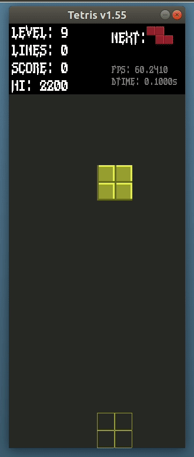

# Tetris

### Copyright (C) 2020 by Robert &lt;modrobert@gmail.com&gt;
### Software licensed under Zero Clause BSD.

---

### Description

Tetris game implementation in C++. The playfield, levels, scoring and keyboard timing is inspired by the NES version of Tetris. This code is based on core design by odyssjii.


---

### Prerequisites

SDL2 (Simple DirectMedia Layer).

In Ubuntu Linux you typically need these dependencies:
```
sudo apt install build-essential libsdl2-2.0-0 libsdl2-dev libsdl2-ttf-2.0-0 libsdl2-ttf-dev
```

---

### Usage

```
./tetris
```

---

### Build targets

Default with sound effects:
```
make
```

Without sound effects:
```
make silent
```

Debug build:
```
make debug
```

Clean between each build:
```
make clean
```

Install after build (need sudo with default directory):
```
sudo make install
```

Uninstall (need sudo with default directory):
```
sudo make uninstall
```

Install XDG Desktop launcher icon (works in Ubuntu, Arch Linux, etc.):
```
make install_desktop_icon
```

Uinstall XDG Desktop launcher icon:
```
make uinstall_desktop_icon
```

---

### Windows...

In order to build this game in Windows you need a C++ compiler and SDL2 libraries. Check [build_win.bat](build_win.bat) for clues how to do this using Visual Studio 2017 Community Edition.

Official SDL2 site:  
https://www.libsdl.org/

#### Compiled and "ready to play" 64-bit build of Tetris for Windows can be found [here](builds/tetris_win.zip). The 'Visual C++ 2017 Redistributable Installer' is included if needed.

